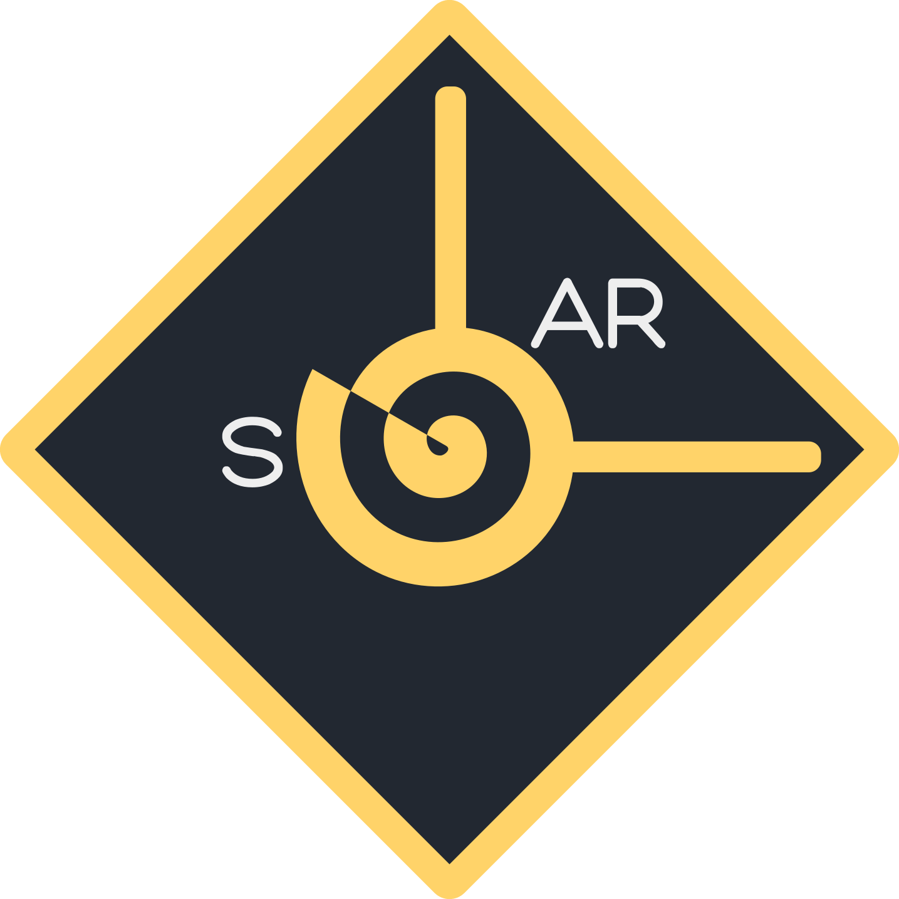

2D OpenGL Game Framework.

---

### Disclaimer

**Solar** framework is free and open-source under the [MIT license](LICENSE).
**Solar** only supports 64-bit Windows applications (for now).

**Solar** is an education project for learning purposes, feel free to use it in personal and commercial projects, just keep in mind that support is minimal.

---

### Requirements:

- Visual Studio 2019 (Untested on older versions of Visual Studio)
- or Visual Studio Code.
- Visual C++ compiler.

---

### Getting Started:

Clone Solar repository to your local system using `git clone https://github.com/ThaiDuongVu/Solar.git`

Open Solar solution with Visual Studio.

You can see 2 projects in Solar solution: Solar and Lunar.

<!--  -->

 **Solar** is the framework itself.

 **Lunar** is a sample project, containing examples with commented code and to showcase the capabilities of Solar framework. **Lunar** can be safely deleted from the solution.

**Solar** only supports 64-bit projects therefore **Lunar** is an only 64-bit application.

Hit `Ctrl+Shift+B` to build solution.

<!--  -->

Hit `F5` to run **Lunar**.

<!--  -->

---

### Creating New Projects

1. Right click on solution and choose **Add** **->** **New Project...**

<!--  -->

2. Choose C++ Empty Project.

<!--  -->

3. Name your project and hit **Create**.

<!--  -->

4. Select your newly created project and go to **View** **->** **Other Windows** **->** **Property Manager**.

<!--  -->

5. Right click on your project and choose **Add existing property sheet....**

<!--  -->

6. Select **Solar Project.props** from solution directory.

<!--  -->

7. Right click on project and set it as startup project.

<!--  -->

And *voila* you have a project configured to work with Solar framework, time to jump into the code.

8. Verify everything is working by creating a main.cpp in new project and running this code:

        #include <Solar.h>

        int main()
        {
            Solar::App *app = new Solar::App();
            app->Run();
        }

9. You should see the following window by default:

<!--  -->

